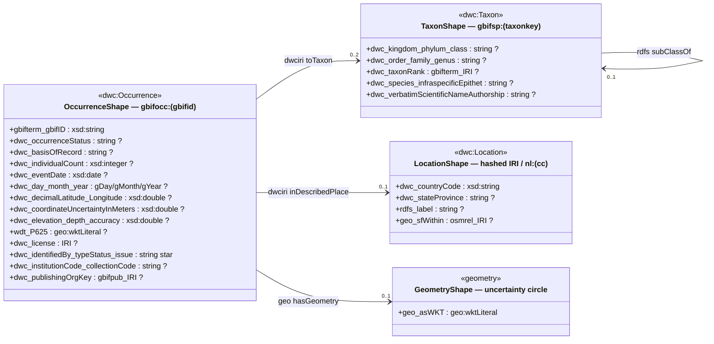

# gbif_parquet to rdf/turtle


To convert GBIF occurences into turtle

```
mvn package -Puber
java --add-modules jdk.incubator.vector --enable-native-access=ALL-UNNAMED -jar target/gbif_parquet-0.4.0-SNAPSHOT-jar-with-dependencies.jar --year 2026 --month 01 --aws --output /dev/stdout
```
Although the two options `--enable-native-access=ALL-UNNAMED` and `--add-modules jdk.incubator.vector` are optional.
The option `--aws` downloads the files from AWS OpenData if they are not locally present yet.

There is also an option to build a native executable using graal vm
This requires a locally set up graal vm.

```
mvn package -Pnative
./target/OccurencesToRdf --year 2026 --month 02 --aws --output /dev/stdout
```


# Issues

TODO:

1. Scripts assume local relative paths
2. No streaming from S3 directly yet.
3. Occurences snapshots before 2024/02 are not readable (due to schema changes in the parquet files).

# GBIF parquet --> RDF: ShEx shape graph

4 shapes that represent the RDF generated by  `RowToTurtle.java` from the GBIF parquet files. 


